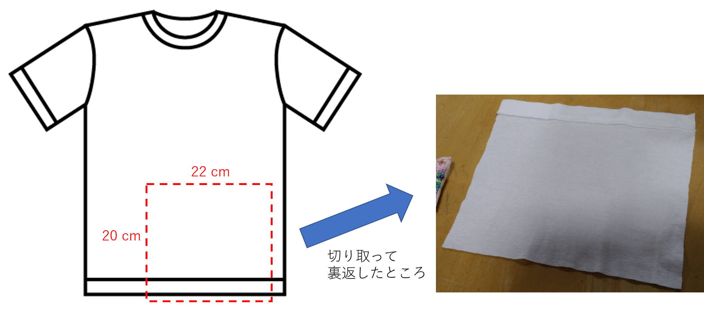
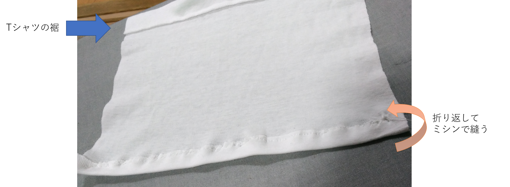
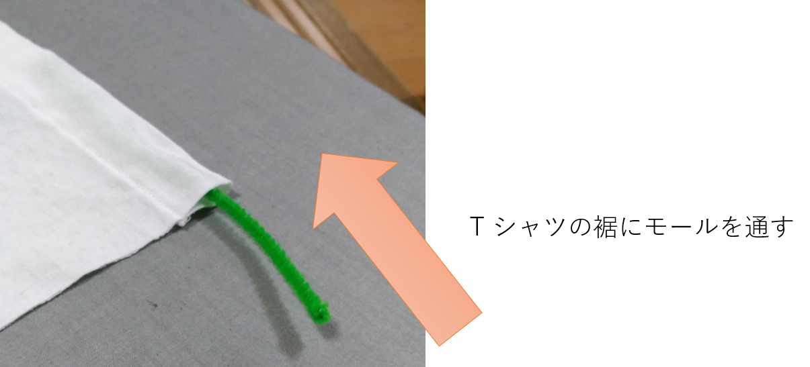
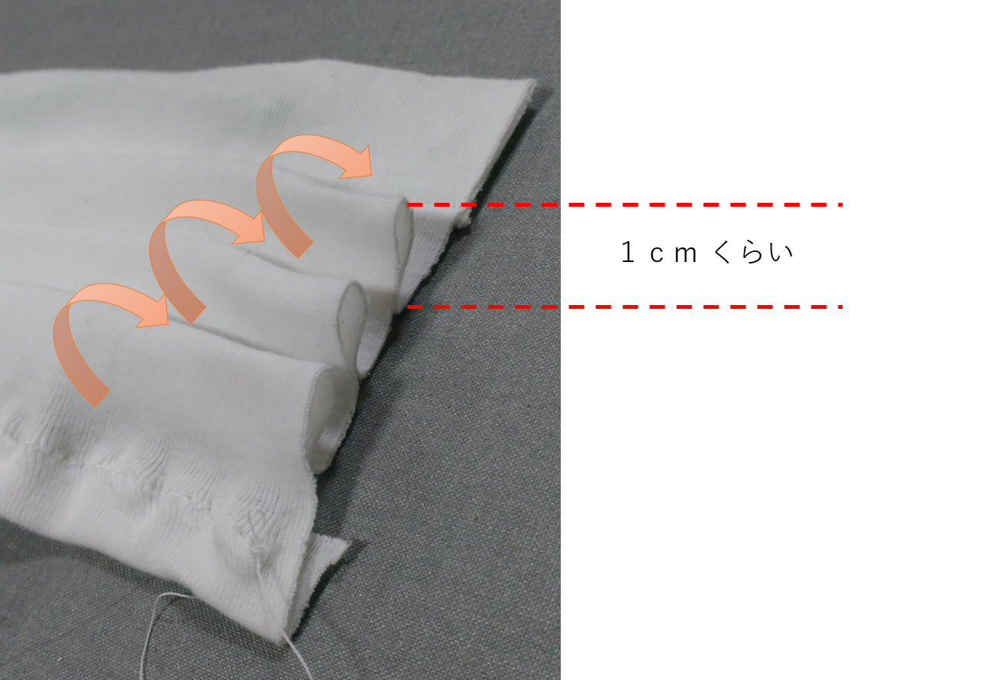
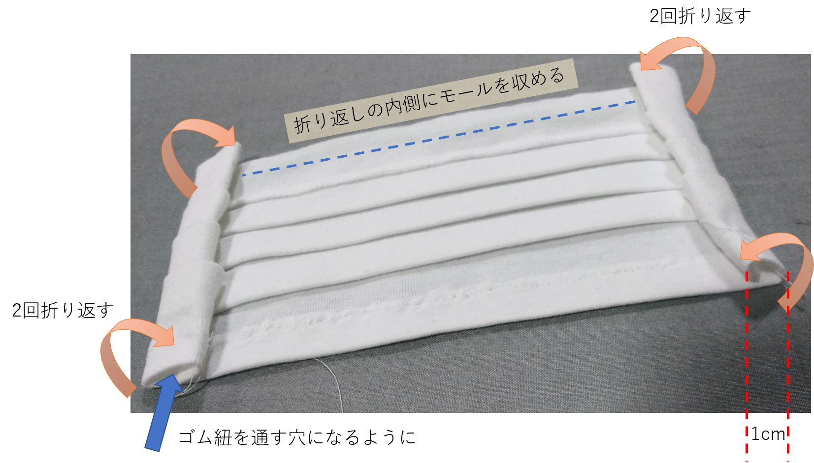
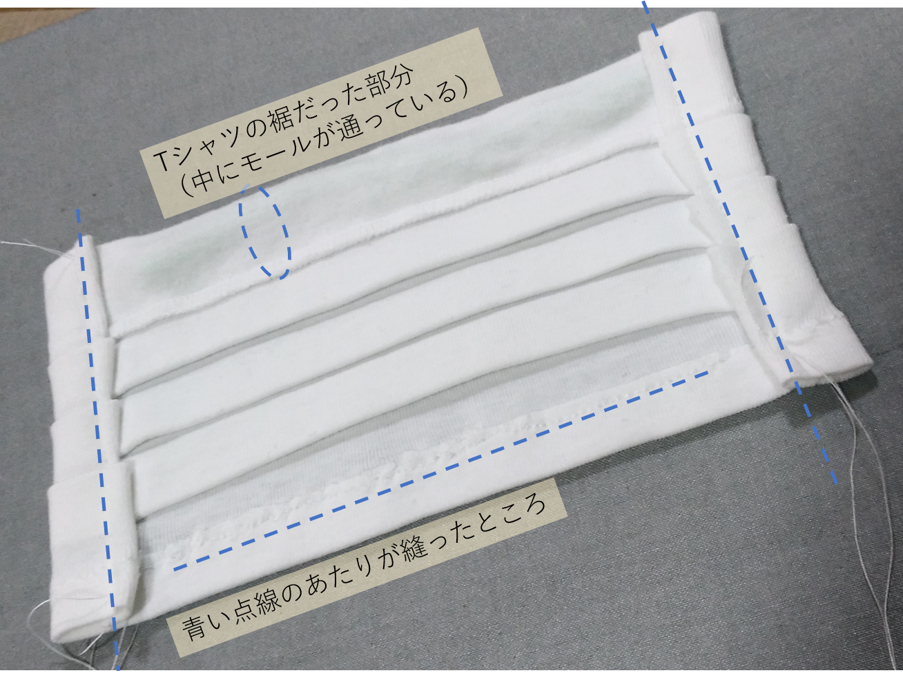
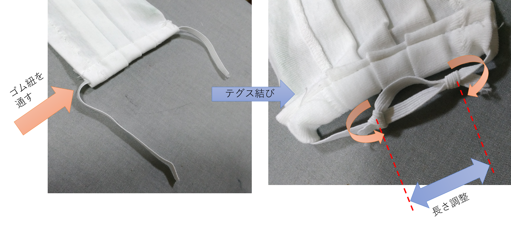
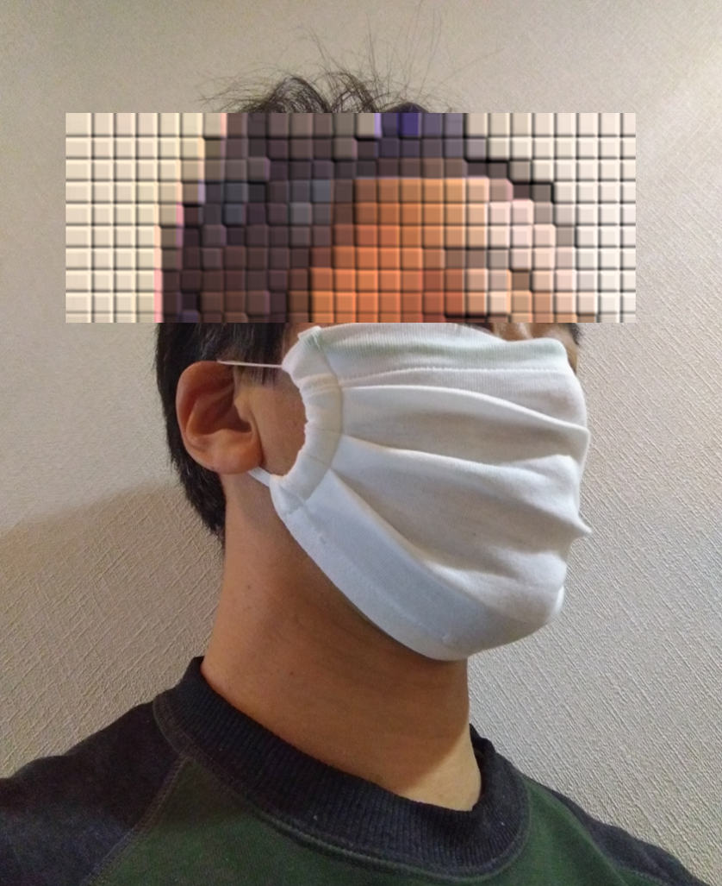

# how-to-make-mask
 COVID-19 でマスクどころか材料も品薄だったので家庭にあった代用品で作ってみました

## 材料をそろえる

- Tシャツ（もう着ない予定のいらないもの、綿100％などの肌触りの良いものがおすすめ）
- モール（針金などの形の帰られるもの、Tシャツの色と合わせると目立たなくてよい）
- 帽子のゴム紐（伸び縮みするゴム紐ならなんでも、これもTシャツの色と合わせられるとよい）

## Tシャツを切る

Tシャツの裾を幅 22 cm × 高さ 20 cm くらいの大きさに切ります。
伸び縮みする素材を使えばあまり正確でなくても大丈夫ですが、大人の男性ならならもう少し大き目に、
子ども用ならもう少し小さ目に切ると良いでしょう。
裾を使うことで切り口を処理する手間を少しだけ省きます。
他の部位を使う場合は少し大き目に生地を切り取りましょう。

## 切り口を処理する

Tシャツの裾の反対側をきれいにしておきましょう。
 1 cm くらい折り返してミシンで縫っておきます。
引き攣れて汚くなってしましましたが、顎の下に隠れるので気にしない方向で。

## モールを通す

T シャツの裾が袋状になっているので、そこにモールを通します。
モールの長さは T シャツの幅からマイナス 5cm くらいに切って入れてしまいます。
ここは鼻の上になって目立つところなので、写真のように白地の生地だと色が透けますので注意。

## プリーツを作る

表側にして 1 cm 程度の幅のプリーツを 3 段作ります。
このままだと崩れやすいのでアイロンをかけて折り目をつけておきましょう。

## 紐通しを作る

裏側にして縁を 1 cm くらい内側に 2 回折り返します。
先ほど通しておいたモールは折り返しの内側に収まるようにしておきます。
折り返したら戻らないようにアイロンをかけておきましょう。

折り返した部分をミシンで縫うとこんな感じ。
マスク本体はこれで出来上がりですので、顔に当ててサイズ感を確認しておきましょう。

## ゴム紐を通して結ぶ

ゴム紐を 30 cm 程度に切ってマスク本体に通します。
輪っかにするときにテグス結びにしておくことで、後で長さを調整できるようにしておきます。

## 完成

それでは装着してみましょう。

## 備考

生地が１枚なのでかなり薄手のマスクになります。
感染対策にどの程度の効果があるかは正直わからないのですが。
この製法ですと大人用の Tシャツから４つ作ることができました。